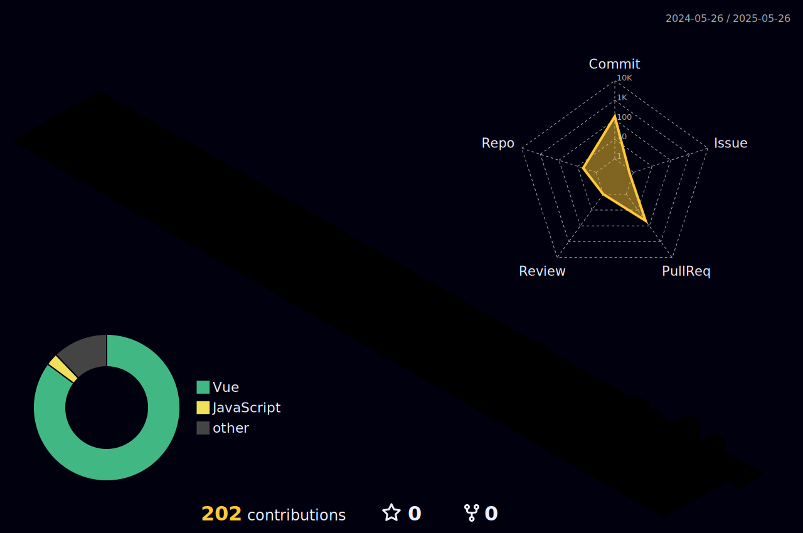

<div align="center">
  
</div>

# 👋 Bem-vindo ao meu GitHub!

<div align="center">
  
</div>

## 💫 Sobre Mim

```javascript
const guilhermeMoura = {
  localização: "Brasil",
  formação: "Análise e Desenvolvimento de Sistemas",
  atuação: "Estagiário em Desenvolvimento Web",
  habilidades: ["Front-end", "Back-end"],
  objetivo: "Evoluir constantemente como desenvolvedor e criar soluções inovadoras 🚀"
}
```

## 🚀 Tecnologias & Ferramentas

<div align="center">
  
  
  
  
  
  
  
  
  
</div>

## 📊 Estatísticas do GitHub

<div align="center">
  
  

</div>

## 🏆 Projetos Destacados

<div align="center">
  <a href="https://github.com/luismoura03/conexao-literaria-front">
    
  </a>
</div>

## 🌐 Perfil social

<div align="center">
  <a href="https://www.linkedin.com/in/luistorresdemoura/" target="_blank">
    
  </a>
  <a href="luistorresdemoura@gmail.com" target="_blank">
    
  </a>
  <a href="https://www.instagram.com/guiskt1/" target="_blank">
    
  </a>
</div>

<div align="center">
  <br>
  <p>Obrigado pela visita! 👋</p>
  
</div>
